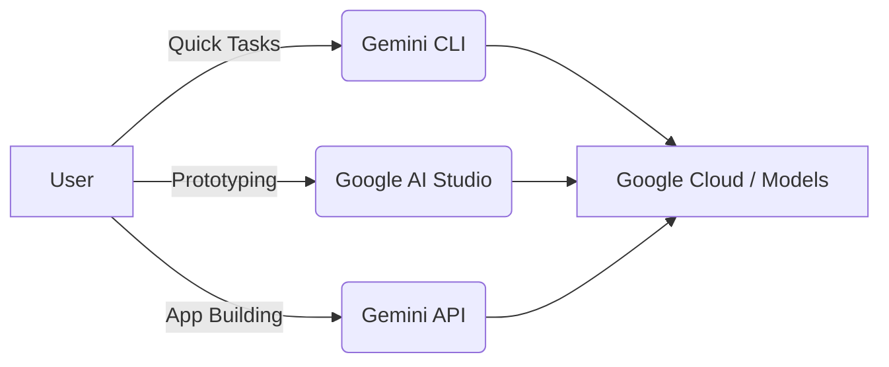
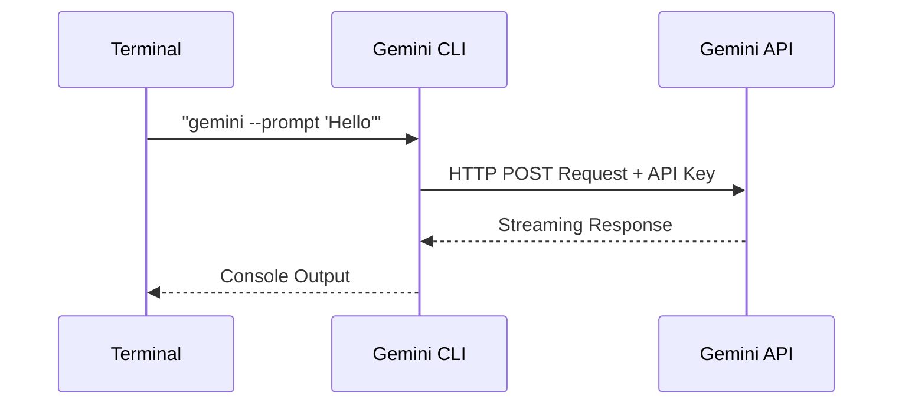
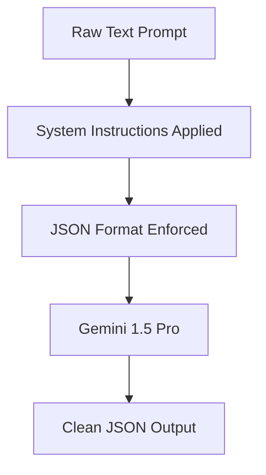
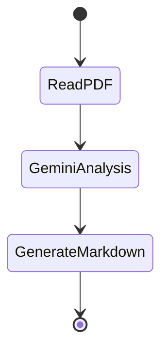
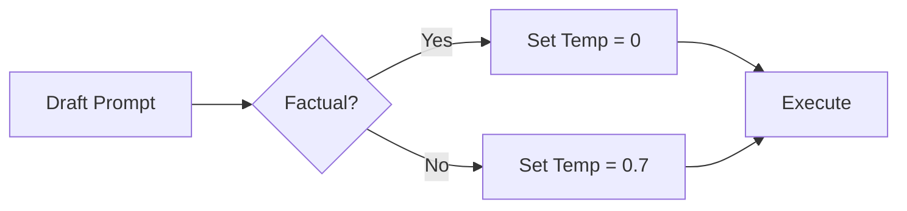

# Gemini CLI: Zero to Hero Masterclass


Welcome to the ultimate guide to the **Gemini Command Line Interface (CLI)**. Over the next 6-8 hours, you will transition from learning what the CLI is, to orchestrating complex, automated workflows directly from your terminal.

---

## A. Introduction to Gemini CLI

### What is Gemini?
Gemini is Google's most capable AI model family, designed to be natively multimodal (understanding text, code, images, and audio). 

### What is the CLI used for?
The Gemini CLI brings the power of Gemini directly into your terminal. Instead of writing a full Python script to interact with the API, or clicking through a web interface, you can pass files, stream responses, and pipe outputs directly in your shell.

### When to use CLI vs API vs Studio?

::: {.callout-tip}
- **Google AI Studio:** Best for prototyping, testing prompts visually, and tweaking hyperparameters.
- **Gemini CLI:** Best for fast, daily automation (e.g., summarizing local files, writing quick shell scripts, analyzing logs).
- **Gemini API (Python/Node):** Best for building full-stack applications with custom logic and persistent databases.
:::



---

## B. Installation & Setup

### Installing the CLI
To install the Gemini CLI globally via `npm` (Node Package Manager), run:

```bash
npm install -g @google/generative-ai-cli
```

### Authenticating with Google
The CLI requires an API key. Get your key from [Google AI Studio](https://aistudio.google.com/), then export it as an environment variable:

```bash
# On Mac/Linux
export GEMINI_API_KEY="your-api-key-here"

# On Windows (PowerShell)
$env:GEMINI_API_KEY="your-api-key-here"
```

### Architecture Overview



---

## C. First Steps with Gemini CLI

### Running your first command
Let's run a simple prompt:

```bash
gemini --prompt "Explain quantum computing in one sentence."
```

**Output:**
> Quantum computing uses the principles of quantum mechanics to process information in ways that allow it to solve certain complex problems exponentially faster than classical computers.

### Using text prompts and standard input
You can pipe output from other commands directly into Gemini:

```bash
echo "Translate 'Hello World' to French" | gemini
```

### Using files as input
Want to summarize a local file? Use the `--media` flag:

```bash
gemini --prompt "Summarize this log file" --media error_log.txt
```

---

## D. Advanced Prompting with the CLI

### System Instructions
System instructions set the behavior of the model for the entire session.

```bash
gemini --prompt "Write a function" --system-instruction "You are a senior Python developer. Only output raw code, no markdown formatting."
```

### Structured Outputs
You can force Gemini to return JSON, which is essential for scripting.

```bash
gemini --prompt "List 3 colors" --response-mime-type application/json
```



---

## E. Working with Files, Images, and Audio

Gemini 1.5 Pro has a massive context window. You can pass images and audio directly from your hard drive!

### Image Understanding
```bash
gemini --prompt "What framework is this UI using?" --media screenshot.png
```

### Audio Transcription
```bash
gemini --prompt "Transcribe this meeting and list action items." --media meeting.mp3
```

> [!WARNING]
> Safety Considerations: The CLI adheres to Google's safety guidelines. If you pass an image that violates these policies, the API will return a `FinishReason.SAFETY` block.

---

## F. Building Small Tools with Gemini CLI

The real power of the CLI is automation. You can wrap CLI commands inside Bash or PowerShell scripts.

### Example: Summarizing all files in a folder
Create a `summarize.sh` script:

```bash
#!/bin/bash
for file in *.md; do
  echo "Summarizing $file..."
  gemini --prompt "Summarize this file in 1 bullet point" --media "$file" >> summaries.txt
done
```

---

## G. Mini-Project 1: The Command-Line Research Assistant

**Goal:** Build a script that reads a PDF document, generates key insights, and saves a final markdown report.

### Step 1: The Script
Create `research.sh`:

```bash
#!/bin/bash
FILE=$1
echo "# Research Report: $FILE" > report.md
echo "Generating insights..."
gemini --prompt "Analyze this document and extract the top 3 insights." --media "$FILE" >> report.md
echo "Report generated!"
```

### Step 2: Execution
```bash
chmod +x research.sh
./research.sh annual_report.pdf
```



---

## H. Mini-Project 2: Content Generator

**Goal:** Build an advanced CLI workflow that creates an Instagram script based on a trending topic.

### The Workflow
1. User provides a topic.
2. Gemini CLI generates a script.
3. The script is formatted using JSON to separate the "Visual" and "Audio" columns.

```bash
gemini --prompt "Write an Instagram reel script about AI tools. Provide the output as JSON with an array of 'scenes' containing 'visual' and 'audio'." --response-mime-type application/json > script.json
```

### Expected Output
```json
{
  "scenes": [
    {
      "visual": "Person looking stressed at computer.",
      "audio": "Tired of repetitive coding tasks?"
    }
  ]
}
```

---

## I. Best Practices & Optimization

- **Reduce Hallucinations:** Use the `--temperature 0` flag for factual, analytical tasks.
- **Debugging:** If the CLI fails, add `--debug` to see the raw HTTP request/response.
- **Workflow Structure:** Keep your system instructions in a separate text file and read them via `cat system.txt | gemini ...` to keep your commands clean.



---

## J. Final Quiz + Recap

### Recap
You have learned how to install the Gemini CLI, pipe data, use system instructions, process multimodal files, and build automated Bash scripts.

### Quiz
1. **What flag is used to pass a local image file to the CLI?**
   - A) `--file`
   - B) `--media`
   - C) `--image`
   *Solution: B*

2. **How do you force the CLI to return JSON?**
   - A) `--json`
   - B) `--format json`
   - C) `--response-mime-type application/json`
   *Solution: C*
